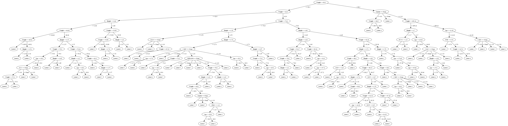
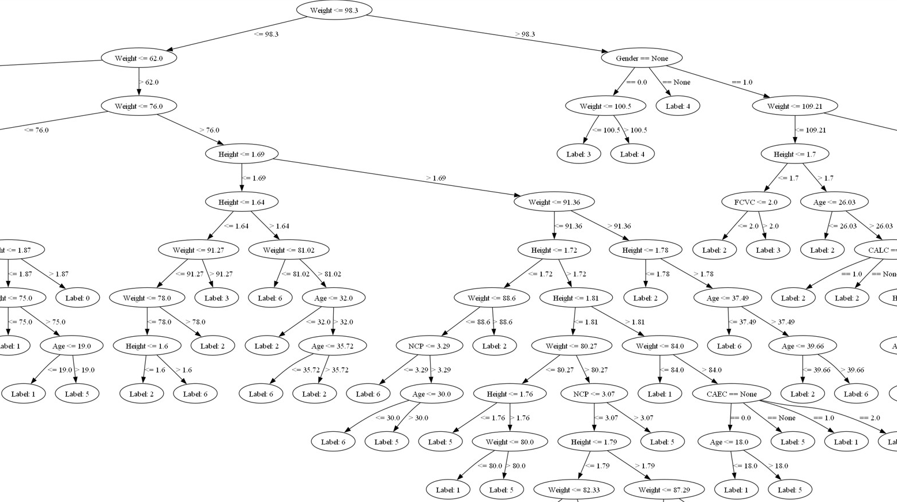
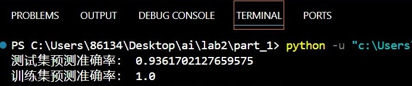
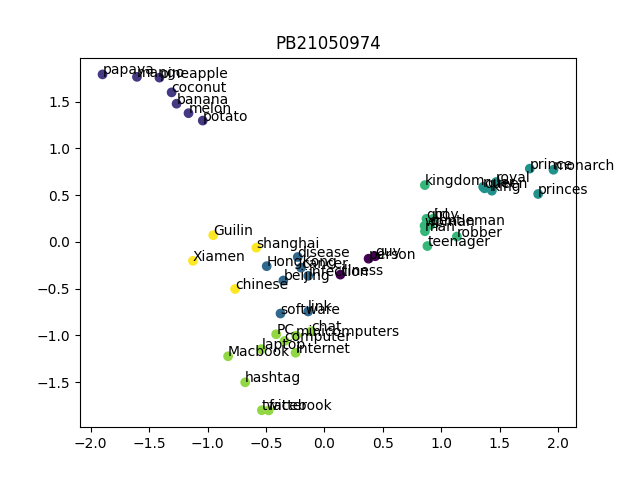
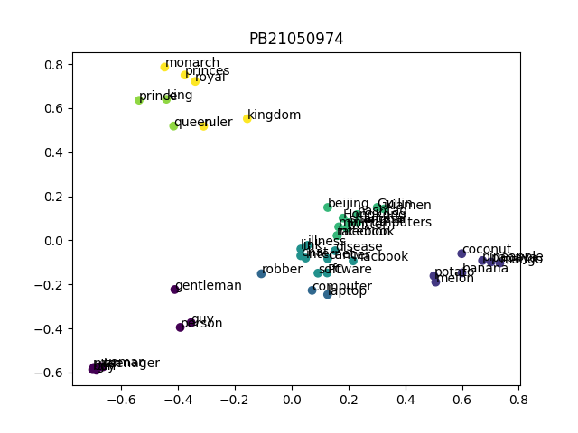
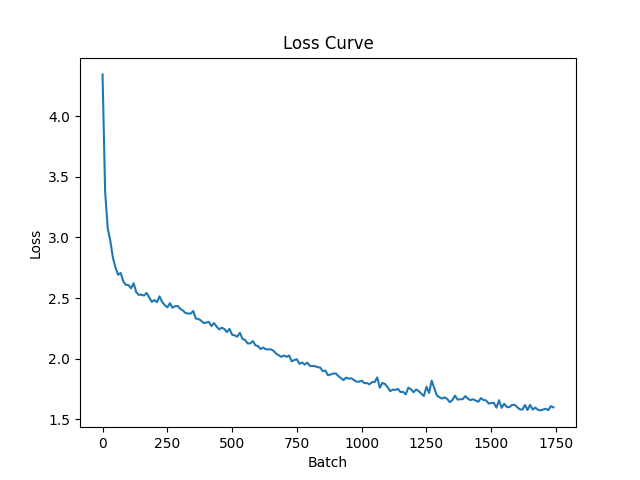
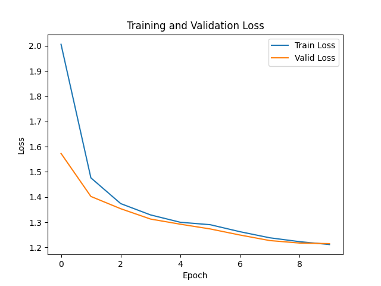

<b>人工智能基础第二次实验</b>

<b>林文浩 PB21050974</b>

#### 一、决策树

__原理和步骤：__

首先对传入的数据进行处理，这一步原本代码框架里已经有了，就不解释了，然后我未来操作方便将Pandas DataFrame转换为了numpy数组

~~~python
# 将X由Pandas DataFrame转换为numpy数组
    X_train = X_train.to_numpy().round(2)
    X_test = X_test.to_numpy().round(2)
~~~

在DecisionTreeClassifier类的_build_tree中是构建决策树的关键代码：这是一个递归的函数，只需要开始调用一次即可，首先它判断是否应该成为叶子节点（类别相同无需再分类，或者属性集为空，或者树到达最大深度，无法再分类），然后对于每个feature，计算信息增益，计算前先做个判断，对于离散值和连续值信息增益的计算方法不同

~~~python
def _build_tree(self, X, y, depth=0):
		# 所有样本类别相同，无需再分类
        if len(np.unique(y)) == 1:
            return Node(label=y[0])

        # 属性集为空，或者树到达最大深度，无法再分类
        if X.shape[1] == 0 or (self.max_depth is not None and depth >= self.max_depth):
            return Node(label=Counter(y).most_common(1)[0][0])

        # 计算最大信息增益
        best_gain = -1
        best_feature = None
        best_split_value = None
        for feature in range(X.shape[1]):
            # 对于连续值和离散值处理方式不同
            if feature in self.continuous_features:
                gain, split_value = best_split(X, y, feature)
                if gain is not None and gain > best_gain:
                    best_gain = gain
                    best_feature = feature
                    best_split_value = split_value
            else:
                gain = information_gain(X, y, feature)
                if gain > best_gain:
                    best_gain = gain
                    best_feature = feature
                    best_split_value = None

        # 最大信息增益为0，说明所有样本的属性相同，无法再分类
        if best_gain == 0:
            return Node(label=Counter(y).most_common(1)[0][0])

        # 最大信息增益不为0，可以进行分类，递归生成子树
        node = Node(feature=best_feature, split_value=best_split_value)
        if best_split_value is None: 
            # 离散值
            values = np.unique(X[:, best_feature])
            for value in values:
                idx = X[:, best_feature] == value
                child_node = self._build_tree(X[idx], y[idx], depth + 1)
                node.branches[value] = child_node
                # 当没有匹配的分支时，预测值取当前节点概率最大的类别
                node.branches[None] = Node(label=Counter(y).most_common(1)[0][0])
        else: 
            # 连续值
            left_mask = X[:, best_feature] <= best_split_value
            right_mask = X[:, best_feature] > best_split_value
            node.branches['left'] = self._build_tree(X[left_mask], y[left_mask], depth + 1)
            node.branches['right'] = self._build_tree(X[right_mask], y[right_mask], depth + 1)

        return node
~~~

信息熵的计算：

~~~python
def entropy(y):
    counter = Counter(y)
    total = len(y)
    Ent = -sum((count / total) * np.log2(count / total) for count in counter.values())
    return Ent
~~~

离散值的信息增益由information_gain函数计算：

~~~python
def information_gain(X, y, feature, split_value=None):
    total_entropy = entropy(y)
    
    if split_value is None:
        values, counts = np.unique(X[:, feature], return_counts=True)
        weighted_entropy = sum((counts[i] / np.sum(counts)) * entropy(y[X[:, feature] == v]) for i, v in enumerate(values))
    else:
        left_mask = X[:, feature] <= split_value
        right_mask = X[:, feature] > split_value
        left_entropy = entropy(y[left_mask])
        right_entropy = entropy(y[right_mask])
        weighted_entropy = (sum(left_mask) / len(y)) * left_entropy + (sum(right_mask) / len(y)) * right_entropy
    
    return total_entropy - weighted_entropy
~~~

而连续值的信息增益由best_split函数计算，其中还顺便求出了最优划分：

~~~python
def best_split(X, y, feature):
    unique_values = np.unique(X[:, feature])
    if len(unique_values) == 1:
        return None, None

    best_gain = -1
    best_split_value = None

    for value in unique_values:
        gain = information_gain(X, y, feature, split_value=value)
        if gain > best_gain:
            best_gain = gain
            best_split_value = value

    return best_gain, best_split_value
~~~

求出所有feature的信息增益后，选取最大的一个作为该节点的分类依据，也就是该节点的feature属性，然后按照该feature递归调用_build_tree生成相应的子树，对于离散值来说，数据里还有几个该离散值的类别就有几棵子树，如果是连续值，则根据最优划分分为左右子树。

预测时，只需要顺着树根往下，每次根据节点的feature属性选择相应的分支直到叶节点，叶节点的label属性就是最终输出结果。

~~~python
 	# 预测一组样本
    def predict(self, X):
        # X: [n_samples_test, n_features]
        # return: y: [n_samples_test]
        # TODO:
        y = np.array([self._predict(inputs) for inputs in X])
        return y

    # 预测一个样本
    def _predict(self, inputs):
        node = self.tree
        while node.branches:
            if node.split_value is None:
                # 离散值
                value = inputs[node.feature]
                if node.branches.get(value) is None:
                    #print("没有匹配的分支") 
                    node = node.branches.get(None)
                else:
                    node = node.branches.get(value)
            else:
                # 连续值
                if inputs[node.feature] <= node.split_value:
                    node = node.branches['left']
                else:
                    node = node.branches['right']
        return node.label
~~~

我还用graphviz将决策树可视化了

~~~python
# 决策树可视化
def visualize_tree(tree, feature_names):
    def add_nodes_edges(dot, node, parent=None, edge_label=""):
        if node.label is not None:
            dot.node(str(id(node)), f"Label: {node.label}")
        else:
            if node.split_value is None:
                dot.node(str(id(node)), f"{feature_names[node.feature]} == {node.value}")
            else:
                dot.node(str(id(node)), f"{feature_names[node.feature]} <= {node.split_value}")

        if parent is not None:
            dot.edge(str(id(parent)), str(id(node)), label=edge_label)

        for key, child in node.branches.items():
            if node.split_value is None:
                add_nodes_edges(dot, child, node, f"== {key}")
            else:
                if key == 'left':
                    add_nodes_edges(dot, child, node, f"<= {node.split_value}")
                else:
                    add_nodes_edges(dot, child, node, f"> {node.split_value}")

    dot = Digraph()
    add_nodes_edges(dot, tree)
    return dot
~~~

可视化的效果如下：

图片在文档里可能看不清，下面是树根附近的放大图，可以看清里面的决策细节

该决策树的预测正确率如下

#### 二、PCA和KMean

__原理和步骤：__

首先定义线性和rbf核函数：

~~~python
def linear_kernel(X, Y):
    return np.dot(X, Y.T)

def rbf_kernel(X, Y, gamma=0.1):
    sq_dists = -2 * np.dot(X, Y.T) + np.sum(Y**2, axis=1) + np.sum(X**2, axis=1)[:, np.newaxis]
    return np.exp(-gamma * sq_dists)
~~~

然后利用核函数计算投影矩阵

~~~python
		#计算核矩阵
        K = self.kernel_f(X, X)

        # 中心化核矩阵
        N = K.shape[0]
        one_n = np.ones((N, N)) / N
        K_centered = K - one_n @ K - K @ one_n + one_n @ K @ one_n

        # 进行特征值分解
        eigenvalues, eigenvectors = np.linalg.eigh(K_centered)

        # 按特征值降序排列特征向量
        sorted_idx = np.argsort(eigenvalues)[::-1]
        eigenvectors = eigenvectors[:, sorted_idx]
        
        # 选择前 n_components 个特征向量
        self.components = eigenvectors[:, :self.n_components]
~~~

在transform函数中，利用已经求得的投影矩阵将数据降维：

~~~python
def transform(self, X: np.ndarray):
        # X: [n_samples, n_features]
        # TODO: transform the data to low dimension

        # 核矩阵
        K = self.kernel_f(X, X)
        # 中心化核矩阵
        N = K.shape[0]
        one_n = np.ones((N, N)) / N
        K_centered = K - one_n @ K - K @ one_n + one_n @ K @ one_n

        return np.dot(K_centered, self.components)
~~~

Kmean算法中，除了初始化之外，循环进行两个步骤：将每个点分配到最近的中心、基于新的点分配更新中心点

~~~python
# 将每个点分配到最近的中心(这里不直接对self.labels进行修改而是返回，是因为预测时也需要用到这段代码，避免预测时破坏聚类的结果)
    def assign_points(self, points):
        # points: (n_samples, n_dims,)
        # return labels: (n_samples, )
        # TODO: Compute the distance between each point and each center and Assign each point to the closest center
        n_samples = points.shape[0]
        labels = np.zeros(n_samples)
        for i in range(n_samples):
            distances = np.linalg.norm(points[i] - self.centers, axis=1)
            labels[i] = np.argmin(distances)
        return labels
~~~

~~~python
# 基于新的点分配更新中心点
    def update_centers(self, points):
        # points: (n_samples, n_dims,)
        # TODO: Update the centers based on the new assignment of points
        for i in range(self.n_clusters):
            points_in_cluster = points[self.labels == i]
            if len(points_in_cluster) > 0:
                self.centers[i] = points_in_cluster.mean(axis=0)
~~~

并在每一轮循环后检查与上一轮循环簇编号是否一致，如果所有点的簇都没变，说明已经收敛

~~~python
# k-means clustering
    def fit(self, points):
        # points: (n_samples, n_dims,)
        # TODO: Implement k-means clustering

        # 初始化中心点
        self.initialize_centers(points)
        
        for _ in range(self.max_iter):
            # 将点分配到最近的簇
            old_labels = self.labels.copy() if self.labels is not None else None
            self.labels = self.assign_points(points)
            
            # 更新中心点
            self.update_centers(points)
            
            # 检查是否收敛
            if np.array_equal(old_labels, self.labels):
                break

        return self
~~~

预测时，查找离点最近的簇中心即可。

聚类后得到的散点图如下

使用线性核函数：

使用RBF核函数：

#### 三、深度学习

训练误差随batch变化，其中每个batch大小为512，每个epoch大约有1740个batch，第一张图仅是第一个epoch中的loss曲线

第二张图显示了loss随epoch的变化，一个训练了十个epoch，约17400个batch，最终loss在1.2附近稳定

模型输入1：

~~~
I could pick my lance
~~~

模型输出1：

~~~
I could pick my lance:
The matter, and therefore I have seen thee thee thee
That I have seen thee thee thee the world,
Th
~~~

模型输入2：

~~~
I could pick my lance
~~~

模型输出2：

~~~
I could pick my lanceord may she speak.

KING RICHARD III:
And therefore the world that thou hast stay'd
The streets of t
~~~

模型输入3：

~~~
I am a cat,
~~~

模型输出3：

~~~
I am a cat,iny of the world,
And therefore the world of the prince of the prince,
And therefore I have strain'd
~~~

可以看到，模型的逻辑能力还比较弱，无法输出合理的续写

我还发现，当模型的训练次数过少时（比如只训练了100个batch），模型会输出类似

~~~
the the the the the the the the the the the the the the the the the the the the the the the the the
~~~

这样的循环，猜测是因为the在训练数据中出现的次数多，模型最先学会的就是the的拼写

还发现一个问题，至今未能解决，当我的模型训练好，直接用于输出时，模型能输出上面那样效果比较好的输出，但当模型save后，下次把训练部分注释掉，load模型直接用，模型的效果就没了，可能模型没有正确保存，不知道这是为什么，我尝试了很久也没能成功解决。
